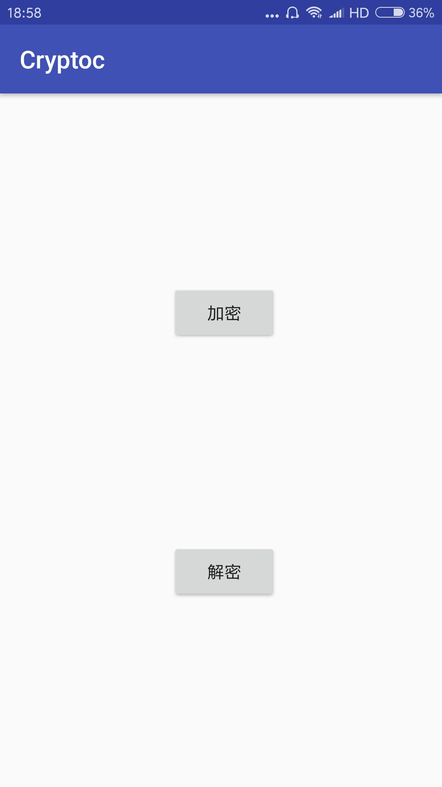
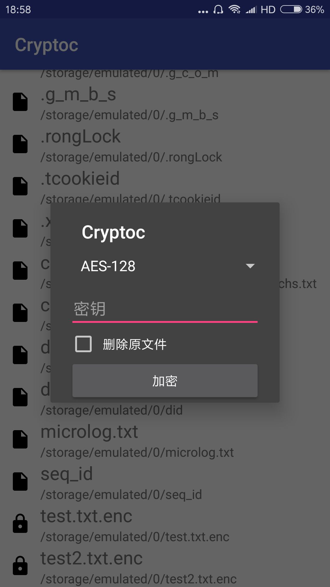

# Cryptoc-android
用来加密/解密文件的简易安卓APP，基于[Cryptoc](https://github.com/Hadron67/Cryptoc)。支持AES、DES、SM4三种算法。加密之后的文件名为原文件名加上“.enc”。

A simple file encryptor/decryptor for Android devices, based on [Cryptoc](https://github.com/Hadron67/Cryptoc). It supports AES, DES and SM4. The name of an encrypted file is the original file name append ".enc".

## Screen shots

